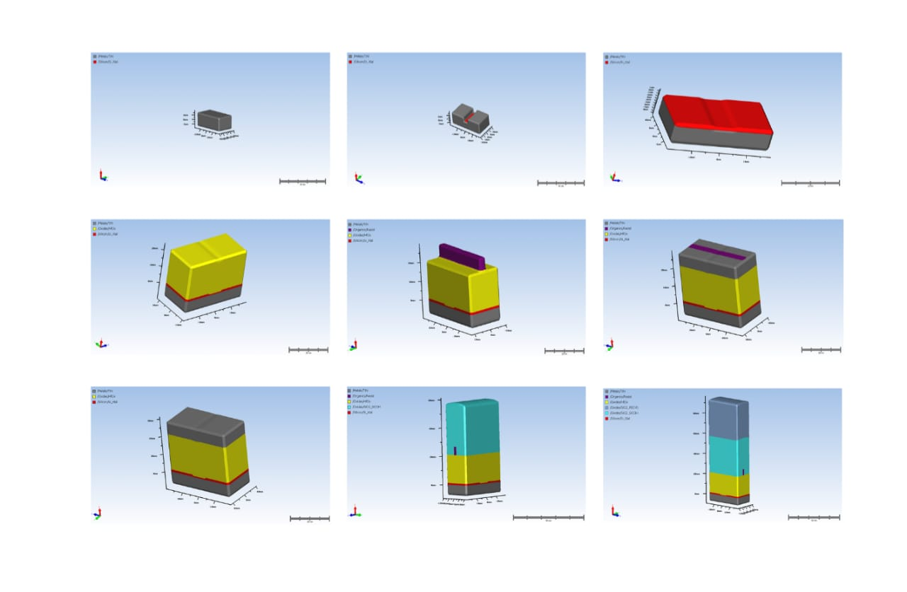

# ⚡️ HfO₂ RRAM Simulation: Resistive Switching Model

## 📈 Key Result: Simulated I-V Characteristics

The I-V curve below is the most critical result, demonstrating the successful simulation of the memory cell's resistive switching behavior. It clearly captures the transitions during the **SET** (forming a conductive filament) and **RESET** operations.

---

## 💡 Project Overview

This repository documents the quantitative modeling and simulation of a **Resistive Random-Access Memory (RRAM)** cell based on a **Hafnium Dioxide ($\text{HfO}_2$)** active layer.

This project showcases strong analytical and simulation skills, making it highly relevant for R&D roles in quantitative modeling, specialized Machine Learning, and semiconductor physics internships.

**Goal:** Develop a robust, predictive physical model in **MATLAB** that accurately captures the electrical dynamics and physical mechanisms of the RRAM device's non-volatile switching behavior.

### 🛠️ Methodology & Key Technologies

| Tool/Domain | Functionality Demonstrated |
| :--- | :--- |
| **MATLAB** | Core platform for implementing and solving the physical resistive switching model using complex system equations. |
| **SEMulator3D** | Used for defining the precise 3D structure and process integration steps of the memory cell. |
| **Quantitative Analysis** | Applying and validating models based on physical parameters, a core data science skill. |
| **Semiconductor Physics** | Application of theory governing conductive filament formation and rupture in metal oxides. |

---

## 🔬 Device Structure

This image illustrates the final 3D structure of the simulated RRAM cell, as designed and modeled for the analysis.

---

## 📁 Repository Files & Documentation

| File Name | Description |
| :--- | :--- |
| **[`RRAM_ppt.pptx`](./RRAM_ppt.pptx)** | **(High-level Presentation)** A summary of the methodology, results, and conclusions. |
| **[`IV Char.png`](./IV%20Char.png)** | (Key Result) The primary I-V characteristic plot. |
| **[`process.jpg`](./process.jpg)** | (Process Guide) Image outlining the step-by-step simulation methodology. |
| **[`catLayout.jpg`](./catLayout.jpg)** | (Source Layout) Image of the raw device layout used in $\text{SEMulator3D}$. |
| **[`catFile.jpg`](./catFile.jpg)** | (Source File) Image of the CAT file contents/parameters. |
| **[`RRAM.jpg`](./RRAM.jpg)** | (Key Visual) 3D render of the RRAM device. |
